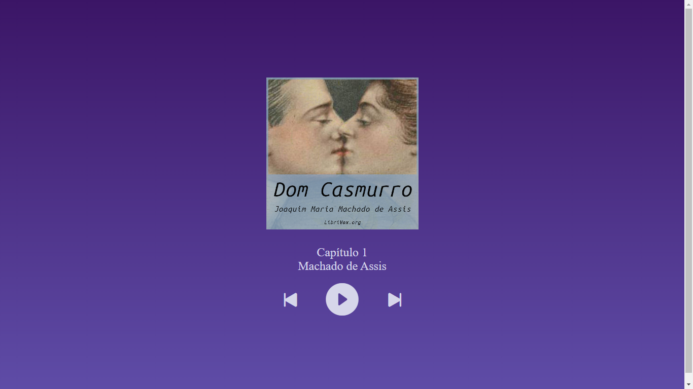

# Audiobook
## Projeto Simples de audiobook de Dom Casmurro
<p>Este projeto foi criado como parte do intensivão oferecido pela <a href='https://www.hashtagtreinamentos.com/' target='_blank'>Hashtag Treinamentos</a>, com o objetivo de conhecer comandos básicos de JavaScript.</p>
<p><a href='https://talitasdias.github.io/audiobook/index.html'>Clique para acessar</a></p>



## Como Utilizar
<ol>
  <li>Abra o terminal ou prompt de comando no diretório desejado.</li>
  <li>Clone o repositório usando o seguinte comando:</li>
  
  ```bash
  git clone https://github.com/talitasdias/audiobook.git
  ```

  <li>Navegue até o diretório do projeto:</li>

  ```bash
  cd audiobook
  ```

</ol>
   Agora você está pronto para começar a usar e modificar a página!
